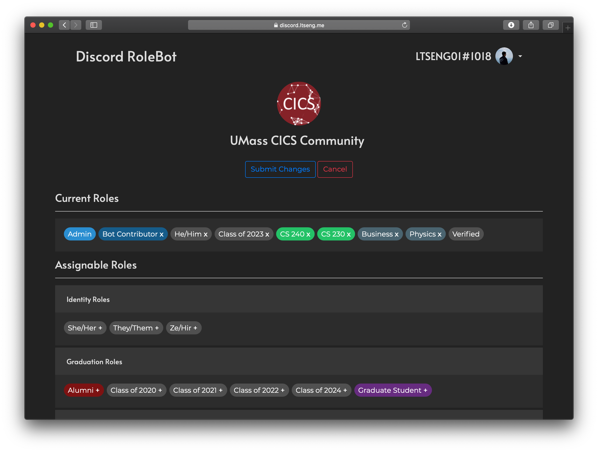

# Discord RoleBot
A user-friendly web tool authenticated by Discord OAuth2 to assign and manage Discord roles on a Discord server.

- Utilizes [Discord's v6 API](https://discord.com/developers/docs/intro)
- Back-end REST API written in Typescript, using [Deno](https://deno.land) and [oak](https://oakserver.github.io/oak/)
- Front-end client written in HTML5, CSS, and JavaScript. Uses jQuery, Bootstrap, Popper, and Google Fonts.
- Accompanied with a Discord Bot

### Dashboard Screenshot

